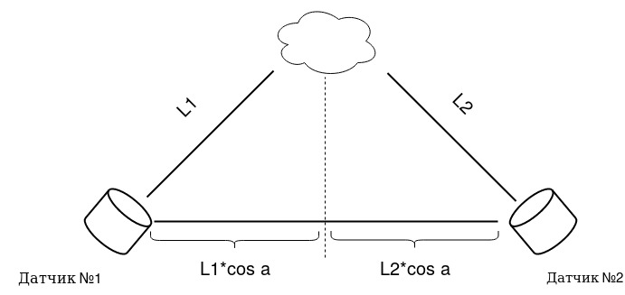
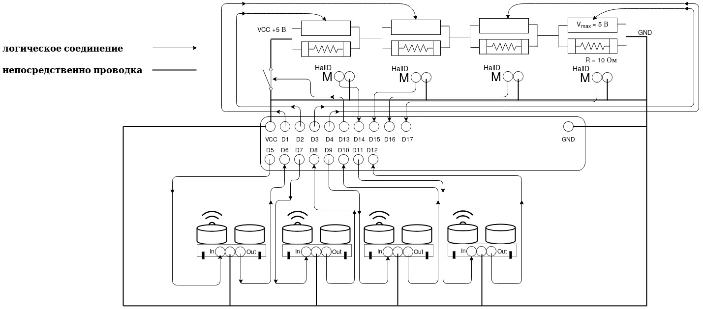

Hey there! Here is my project called SmarTClouD. 

Project includes:
  - Schemes of magneto-levitating system
  - Source code of levitron
  - And README file, that i hope will help you to understand what's going on
  
 ## !ACHTUNG!
  You better watch to the schemes if you wanna understand all case or skip this part and just download project folder (Levitron). 
  
  ## Intro
  
This repository combines two different projects: the megneto levitating system and the colormusic for the cloud. 
I’ve tride to make such cloud as Richard Clarkson’s studio produces. 
 *link : https://www.rclarkson.com/collections/clouds/products/floating-cloud

The main idea of the project was the levitating cloud above some sort of platform.
I used the crealev company magnet levitation system patent to create the base of project (platform), but whith my own coil-control system. 
 *link : https://www.crealev.com/levitation-modules
 
  
Imho magnet-levitation project are divided into 3 cases:

First one is quite simple. The solenoid, that positioned above magnet, turns off or on depending on Hall sensor’s testimony. There are examples:

Next two types are similar in the global way: the levitation effect is achieved because of characteristic that any magnet has to push off from other magnets if they are turned to each other with same pole. But the main disadvantage is quite strong instability of the all system (this is especially seen in the second levitron type). 
In case of that we have to use some kind of magnets, that could pull the levitating body to the center of construction. Here is the main differences between 2nd and 3rd magnet levitation types: in case of the solenoid magnets are stronger than even neodymium ones, therefore the changes in solenoid coils produce much stronger difference for the all construction. In the second type we use permanent magnets around the platform to pull off levitating body and solenoid coils to pull it right to the center. 

Second type used to be composed from permanent magnet and about 4 solenoid coils, which are equidistant from center of platform, also they have some sort of control stuff (as usual Hall sensor) right in center of platform.
Example:

But the third type use solenoids to provide the pull off force and permanent magnets to pull the levitating body to the center, this is the most optimal way of realization magnet levitation that i know. Also it used to be pretty much stronger than the second one and they have different control system of above-thing (levitating body); for example, Crealev uses magneto-optical control system, based on magnet Kerr effect and light polarization. Personally I used ultrasonic sensors to find out distance between sensor and the levitating body, then to figure out deviation of each axis (x and y) from “perfect” axis z (witch is positioned right in the middle of the levitating body and in the middle of the platform), I used differences between cos from each distance. After all manipulations, if deviation of axis is positive, that means that incline of levitating body is on the right side, so resistance of potentiometer that is paralleled to the coil of the right side is decreasing, at the same time, resistance of potentiometer that is paralleled to the coil of the left side of the axis that we are looking at, is increasing until deviation of the axis will be negative or equals 0 (all the opposite for the negative way and delay for zero).
Example of crealev module: 

## Schemes and stuff

Let me introduce you third type magnet levitation project based on arduino mega 2560. First of all let us look to the levitron example: this is a 3D model of levitron from scratch and how it should look like.

  

You may see the x and y axes which used to be some kind of directions, perpendicular to the z axis, that used to be “perfect” axis. It locates in the middle of the each constructions: levitron base and magnet body (deviation of incline should be solved around the “perfect” axis). You may also look at the levitron side and top for better understanding the situation.
Location 1 and 2 shows reader the action of solving schematically.

According to the next scheme designed by crealev, we may see the schematic view of the patent side view that shows the permanent magnet and coil location.
While the next one is the magnet field of the base station (we may closer look at the middle magnet area, that clearly shows the weakness of the middle permanent magnets against the solenoid variable magnetic solenoid field on the sides).

This scheme is exact coil and magnet location in this project 

Next image shows 4 resisto-coil objects, that connected consistently, the rounded line is analog-data connection, that produces signal of changing resistance of potentiometer(in this picture 2 magneto-optic objects are located on each axis).

Scheme zoom schematically shows analog-data signal communication of arduino and auxiliary devices (such as resisto-coil objects, hall and ultrasonic sensors).

On the last main scheme you may see the all picture of connection and communication whole levitation system (line-connection and arrow-line-connection are the wiring and logic respectfully). 

 

  - - - - - - - - - - - - - - - - - - - - - - - - - - - - - - - - - - - - - - - - - - - - - -

Technical shift: probably you'll need 

maybe change const_alpha 

change default_resistance

GL
